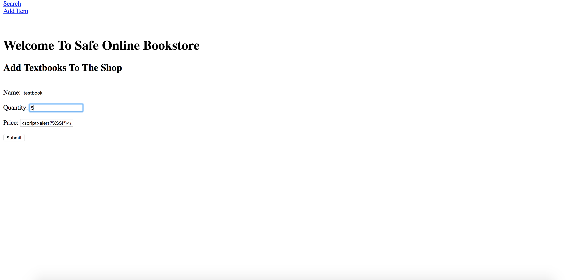
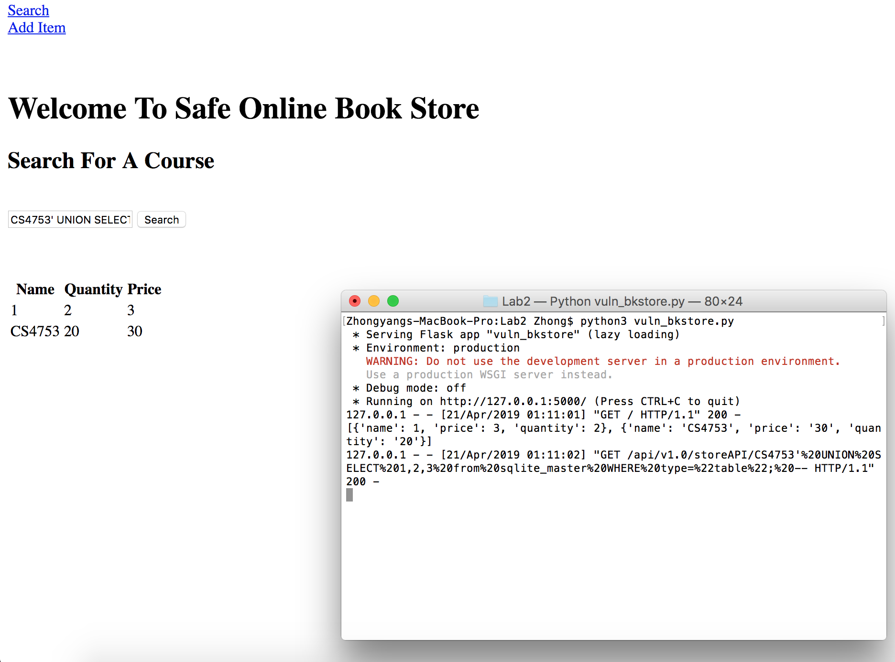

# Simple Vulnerable Online Bookstore Application

Yuhong Zhang yz3385
Zhong Zhu zz1424
https://github.com/YuhongZhang98/Vulnerable_Bookstore

## Overview

Our simple bookstore application holds database entries of books, categorized as book-quantity-cost. There is minimal sanitation of user input; thus, there are many vulnerabilities in which a user can easily manipulate the back-end of our bookstore through the front-end. We are focusing on XSS (Cross-site scripting) and SQL injections with this small web application.

## XSS Attack Example

In our application, a user can easily add malicious code to the database, such as in the value field of an entry. Here, we insert a script into the value field of a created item, instead of a number. 

We add a new item with a value of ``. This would normally create a popup window. However, the unsafe script is saved into the database and will be returned if the book is searched up. Thus the database will run this script! Our app does not sanitize nor check the type of input, among other secure code practices. 

TODO: Add result of attack here

## SQLi Example

A user can easily maliciously manipulate the input forms to gain privileged access to the database; thus, being able to read and write things they aren't supposed to. This is because our application reads the input as actual code! If we input:
`CS4753' UNION SELECT 1,2,3 from sqlite_master WHERE type="table"; --`

We see that we have injected an entry into the database with the name 1, quantity 2, and price 3 - simply from general user input. Thus, our application is vulnerable to malicious code since code is not checked or sanitized.

